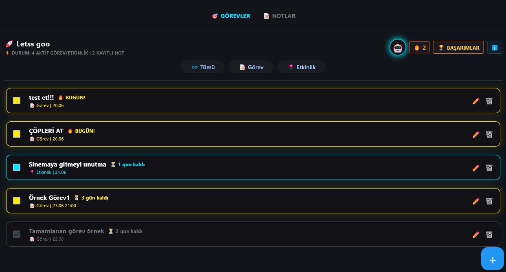
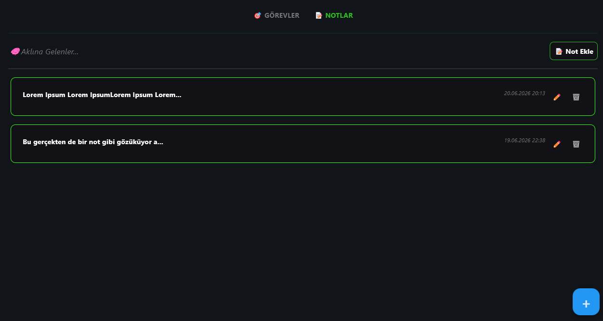

# 🚀 Brodule - Gamified Productivity & Task Manager

A modern, custom-built desktop application designed to make daily task management and note-taking efficient, engaging, and fun. Developed entirely in Python, Brodule gamifies personal productivity to help users maintain focus and consistency.

## ✨ Key Features

* **⏳ Real-Time Countdowns & Tracking:** Easily distinguish between standard "Tasks" and upcoming "Events". The app calculates and displays remaining days for deadlines in real-time.
* **🎮 Gamification & Streaks:** Stay motivated with an integrated achievement system and daily activity streaks (fire icons) that reward consistent productivity.
* **📝 Dedicated Notes Module:** A clean, accessible workspace to jot down quick thoughts, meeting notes, or daily summaries without leaving your task manager.
* **🔔 Automated Notifications:** Built-in alert system to notify you of approaching deadlines, task completions, and mode transitions.
* **🌙 Modern UI (Dark Mode):** A sleek, distraction-free graphical user interface built for long working sessions.

## 🛠️ Tech Stack

* **Language:** Python
* **UI Framework:** Flet (Flutter-based UI for Python)
* **Architecture:** Event-driven desktop application design

## 📸 Showcase

## 🎯 Project Purpose

Brodule was initially developed as a personal tool to overcome the limitations of standard to-do lists. By combining essential task-management features with gamification, it transforms the mundane chore of tracking assignments into an engaging and highly productive daily routine.

---
*Note: This repository serves as a visual showcase. The core source code for Brodule is currently maintained in a private repository.*
